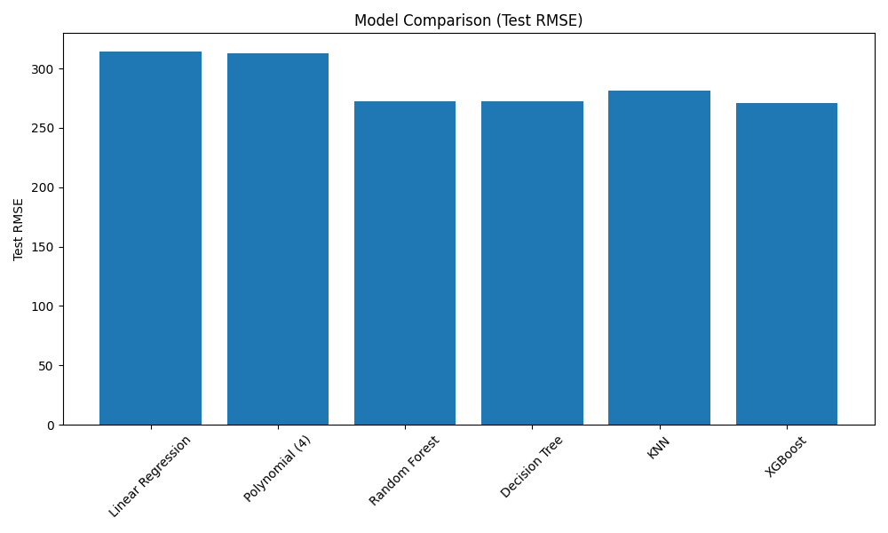

# 👶 Bebek Yaşı Tahmini – Makine Öğrenmesi Projesi

## 📌 Proje Amacı

Bu projede 2023 yılına ait yaklaşık **925.000 gözlem** içeren satış verisi kullanılarak bebek yaşı (ay/gün cinsinden) tahmin edilmiştir.

Çalışmada farklı regresyon modelleri karşılaştırılmış, model performansları değerlendirilmiş ve en düşük hata değerini üreten model belirlenmiştir.

⚠️ Veri ticari gizlilik nedeniyle paylaşılmamıştır.

---

## 📊 İş Problemi

0–4 yaş aralığında faaliyet gösteren bir firma için bebek yaşının doğru tahmin edilmesi:

- Kişiye özel kampanya planlaması
- Tavsiye sistemlerinin iyileştirilmesi
- Stok yönetiminin optimize edilmesi
- Ürün geliştirme stratejilerinin desteklenmesi

açısından kritik öneme sahiptir.

Bu nedenle yaş tahmini, doğrudan iş kararlarını etkileyen stratejik bir tahmin problemidir.

---

## 🔄 Proje Süreci

### 1️⃣ Veri Ön İşleme (R)

- Aylık filtreleme (-6 ile 48 ay)
- BEDEN değişkeninin yaş aralıklarına dönüştürülmesi
- Kategorik değişken düzenlemeleri
- Eksik veri analizi
- Keşifsel veri analizi (EDA)
  - Histogram
  - Density plot
  - Boxplot
  - Ridge plot

### 2️⃣ Feature Engineering

- Beden–yaş dönüşüm mapping işlemleri
- Kategorik değişkenlerin modele uygun hale getirilmesi
- Müşteri bazlı gruplanmış analizler

### 3️⃣ Modelleme (Python)

Aşağıdaki regresyon modelleri karşılaştırılmıştır:

- Linear Regression
- 4. Dereceden Polynomial Regression
- Decision Tree Regressor
- Random Forest Regressor
- K-Nearest Neighbors (KNN)
- XGBoost Regressor

---

## 📈 Model Değerlendirme

Modellerin performansı **Root Mean Squared Error (RMSE)** metriği ile değerlendirilmiştir.

Sonuçlar, **XGBoost modelinin** diğer modellere kıyasla daha düşük RMSE ürettiğini göstermiştir.

Ek olarak:

- Aylık bazda tahmin hata dağılımları incelenmiştir.
- Hataların 0 referans çizgisi etrafındaki dağılımı görselleştirilmiştir.
- Model performansı görsel analiz ile desteklenmiştir.

---

## 🧠 Nihai Sonuç

XGBoost modeli, doğrusal ve ağaç tabanlı diğer modellere göre daha düşük hata üretmiş ve en başarılı model olarak seçilmiştir.

Bu sonuç, doğrusal olmayan ilişkilerin veri içinde önemli olduğunu göstermektedir.

---

## 🛠 Kullanılan Teknolojiler

- **Python** (scikit-learn, XGBoost, pandas, numpy)
- **R** (tidyverse, ggplot2, ggridges)
- Makine Öğrenmesi
- Regresyon Analizi
- Veri Görselleştirme

---

## 📊 Model Performans Karşılaştırması

---
